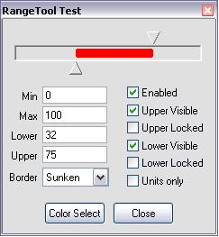



## Range Tool

### Description

This OCX Control is similar to a slider, but has two thumbs which let you define a lower and an upper value. It also features a couple of additional properties which may come in handy. Download is 11.5 kB.
 
### More Info
 

             |
---                |---
**Submitted On**   |2008-01-26 16:05:36
**By**             |[ULLI](https://github.com/Planet-Source-Code/PSCIndex/blob/master/ByAuthor/ulli.md)
**Level**          |Intermediate
**User Rating**    |4.8 (24 globes from 5 users)
**Compatibility**  |VB 6\.0
**Category**       |[Custom Controls/ Forms/  Menus](https://github.com/Planet-Source-Code/PSCIndex/blob/master/ByCategory/custom-controls-forms-menus__1-4.md)
**World**          |[Visual Basic](https://github.com/Planet-Source-Code/PSCIndex/blob/master/ByWorld/visual-basic.md)
**Archive File**   |[Range\_Tool2099711292008\.zip](https://github.com/Planet-Source-Code/ulli-range-tool__1-70009/archive/master.zip)

